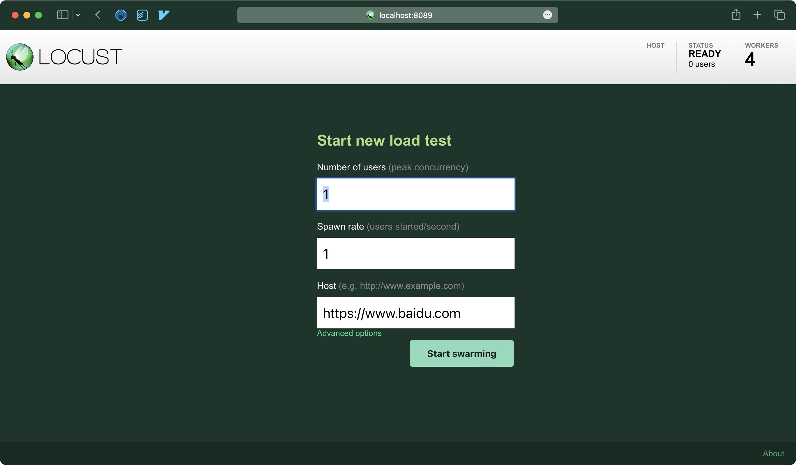
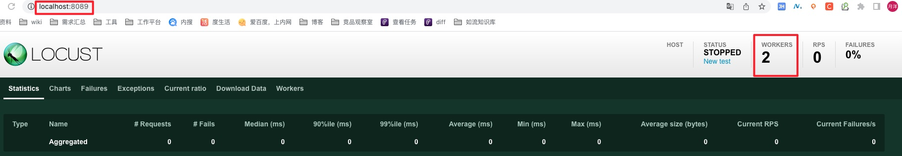

# locust 安全

略

# 压测示例代码

sample230508.py

## 启动压测

```bash
 locust -f sample230508.py
```
## 访问管理端
http://localhost:8089


# 分布式压测
## 启动 master

```bash
 locust -f locust_file.py --master --master-bind-port=8090 （端口可以自己改）
```


## 启动 worker

```bash
locust -f locust_file.py --worker --master-host=<locust_master_machine_ip> --master-port=8090 （端口与 master 机器保持一致）
```



## 一次性启动 master 和 worker

```bash
sh startLocust.sh
```


## 使用 docker 运行 locust

1. 安装 docker
2. 拉取〖locustio/locust〗镜像
3. 运行镜像

```bash
╰─➤  docker run -p 8089:8089 -v $PWD:/mnt/locust locustio/locust -f /mnt/locust/sample230508.py

```

## 使用 docker compose 启动 master 和 4 个 worker

```bash
docker-compose up --scale worker=4
```

